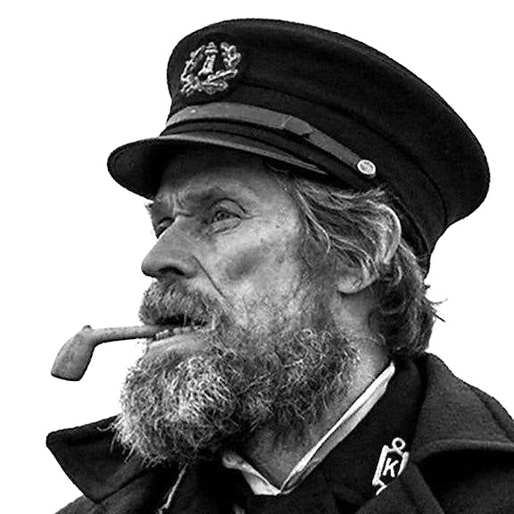
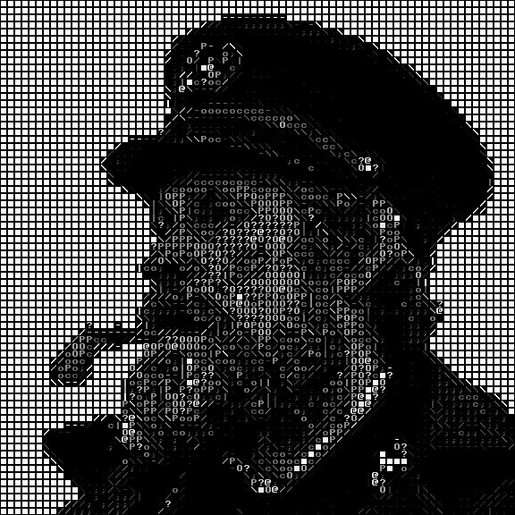

# Image to ASCII image (WIP)

## About
This program can convert a regular image into an image made with ASCII characters.
The main difference between my and most other projects is that it can detect edges. Hence, the objects
will be much more defined using edge characters.

## Example
|           Original           |              ASCII              |
|:----------------------------:|:-------------------------------:|
|  |  |

## Gui


## Usage
```bash
cargo run --release
```


## TODO
- [x] Basic functionality
- [x] Edge detection
- [x] Add GUI
- [ ] Add more options to GUI
    - [x] Image Up scaling
    - [ ] Smarter quantization
    - [ ] Change font
    - [x] Different charset
- [ ] Overhaul the GUI
- [ ] Implement multithreading
- [ ] Create Web App


<sub>Inspired by Acerola</sup>
